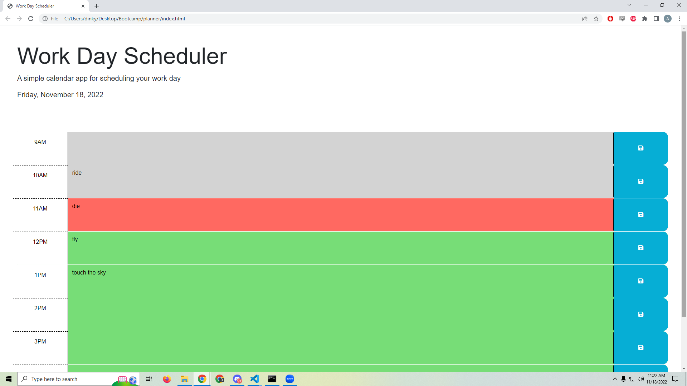

# planner
This planner is color coded to show whether the highlighted text box is timed in the past, present, or future.
The user can enter an item in the corresponding time slot to add a calander event.
The user can save the event to local storage by clicking the save buttton.
Upon refreshing the page, the user will still see their entry in the box.

